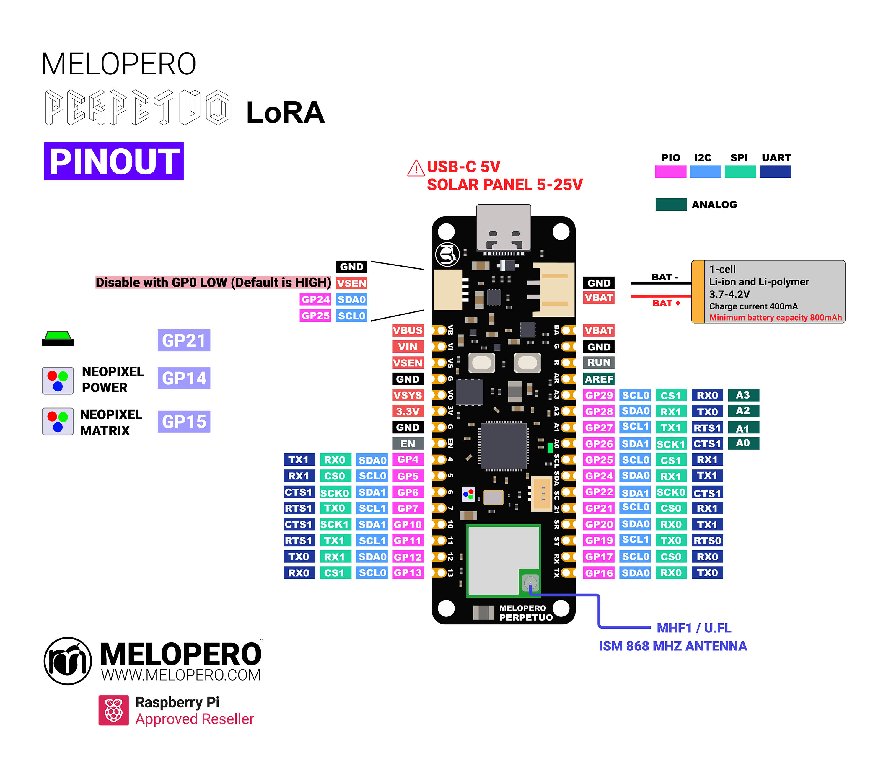

# Melopero Perpetuo Lora

Melopero Perpetuo LoRa is an advanced electronic board built around the powerful Raspberry Pi RP2350 microcontroller. It integrates a LoRa radio module (EMB-LR1276S from Embit S.r.l.), enabling robust wireless communication capabilities.

Designed with sustainability in mind, the board includes a sophisticated LiPo battery charger that can be seamlessly connected to a small solar panel. This feature. allows Melopero Perpetuo to run indefinitely on solar power and a compact battery, making it perfect for off-grid projects.

Get yours here: https://www.melopero.com/shop/melopero/melopero-perpetuo-lora/

